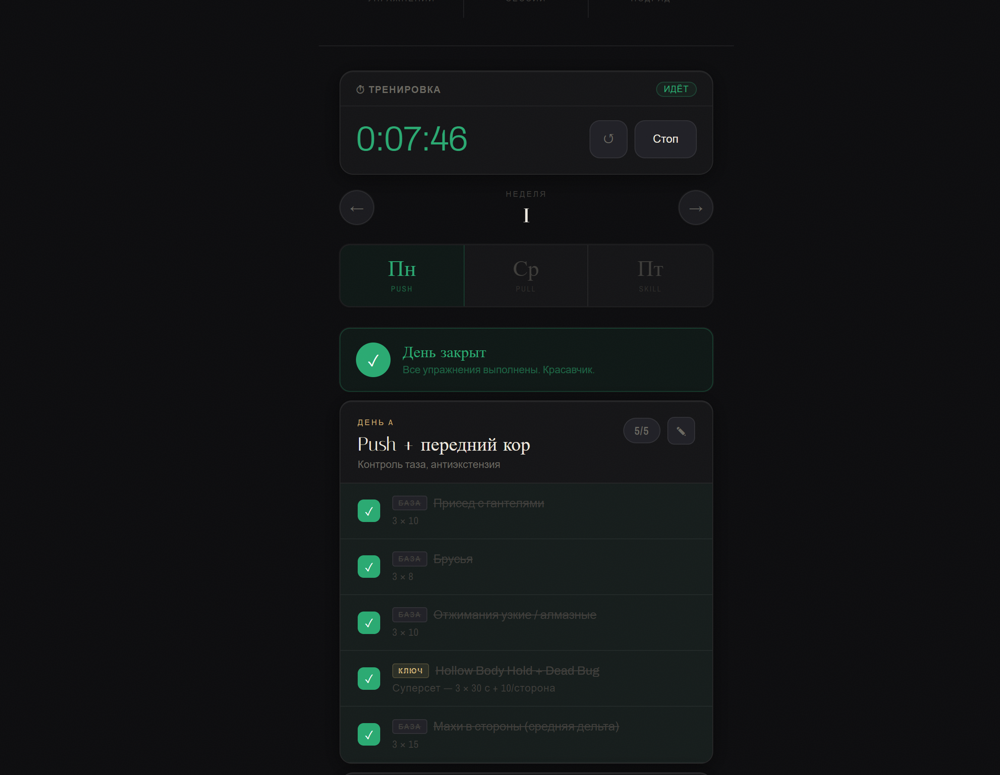
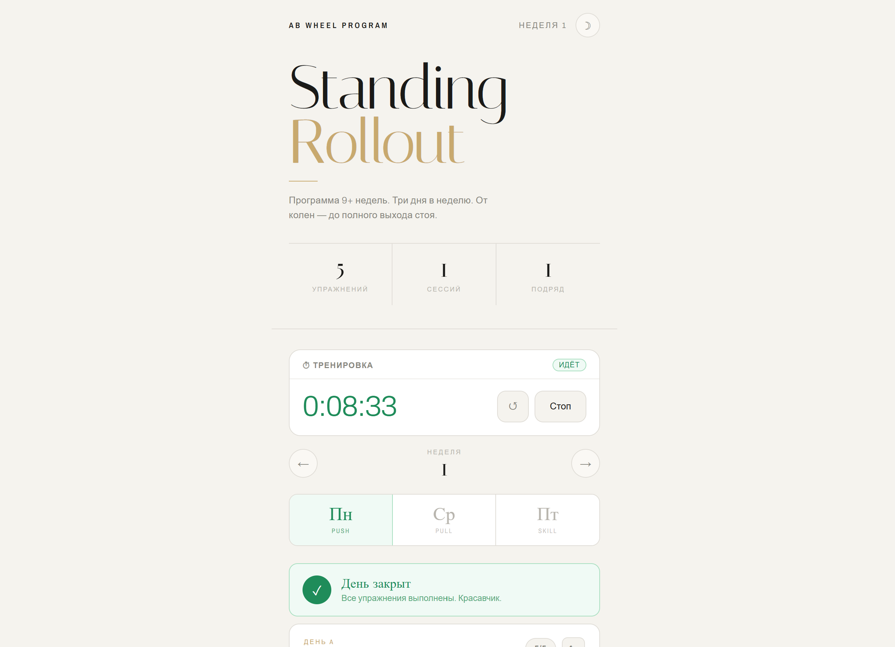

# AB Wheel Tracker

Minimalistic web application for tracking an ab wheel standing rollout progression program.

Built as a lightweight offline-first training tracker with:
- workout checklists
- progression roadmap
- rest timer
- workout stopwatch
- notes system
- dark/light themes
- localStorage persistence
- mobile-friendly UI

---

## Features

### Training System
- 3-day weekly split
- standing rollout progression
- editable exercises
- progression phases
- session tracking

### Built-in Tools
- interval rest timer
- workout stopwatch
- daily notes
- completion animations
- vibration feedback
- notifications

### UX
- responsive layout
- offline support
- dark mode
- lightweight single-file architecture
- no frameworks
- no dependencies

---

## Tech Stack

- HTML5
- CSS3
- Vanilla JavaScript
- LocalStorage API
- Service Worker API
- Wake Lock API

---

## Screenshots

### Dark Theme



### Light Theme



---

## Live Demo

GitHub Pages:
https://YOUR_USERNAME.github.io/ab-wheel-tracker/

---

## Installation

Clone repository:

```bash
git clone https://github.com/YOUR_USERNAME/ab-wheel-tracker.git
